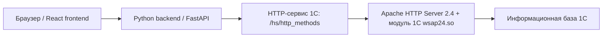

# DOC-INT-002. Интеграция 1С и Python через Apache

| Версия | Статус | Дата создания | Дата обновления |
|---|---|---|---|
| v1.0 | Draft | 2026-05-22 | 2026-05-22 |

О документе: подробная инструкция по основному способу связать 1С и Python-бэкенд CRM_14 через публикацию 1С на Apache HTTP Server.

Для кого: для 1С-разработчика, backend-разработчика и человека, который поднимает демонстрационный или серверный контур проекта.

## 1. Что именно мы соединяем

В проекте CRM_14 Python-бэкенд не подключается к файлам базы 1С напрямую. Он обращается к 1С как к HTTP-сервису.

Целевая схема:



Для Python это выглядит как обычный HTTP API:

```text
http://<host>/<publication>/hs/http_methods
```

Для текущего локального контура проекта уже используется URL:

```text
http://127.0.0.1:8314/Infobase/hs/http_methods
```

При публикации через Apache URL обычно будет таким:

```text
http://127.0.0.1/crm14/hs/http_methods
```

или на сервере:

```text
https://crm14.example.ru/crm14/hs/http_methods
```

## 2. Когда выбирать Apache

Apache является приоритетным способом, если нужно:

- приблизить стенд к реальной эксплуатации;
- открыть 1С через стандартный веб-сервер;
- использовать стандартный механизм публикации 1С через `webinst`;
- подключить TLS/HTTPS, доменное имя, логи Apache и ограничения доступа;
- отделить Python-приложение от механики запуска 1С.

Docker удобнее для быстрого стенда, но Apache понятнее для классического 1С-контура и лучше подходит для документации демонстрационной защиты.

## 3. Важные ограничения

1. Версия платформы 1С, которой выполняется публикация, должна совпадать с версией платформы, через которую будет работать информационная база.
2. Разрядность Apache и модуля 1С должна совпадать. Для 64-bit Apache нужен 64-bit модуль 1С.
3. Для Apache 2.4 используется ключ `-apache24` и модуль `wsap24.so`.
4. Если база файловая, пользователь Apache должен иметь права на папку базы.
5. Если база клиент-серверная, Apache обращается к кластеру 1С по строке подключения `Srvr=...;Ref=...;`.
6. Python не должен читать файлы 1С напрямую. Python должен работать только через опубликованный HTTP-сервис.

## 4. Проверенные версии и компоненты

Актуально на 2026-05-22.

| Компонент | Что использовать | Комментарий |
|---|---|---|
| 1С | Текущий локальный проект: `/opt/1cv8/8.5.1.1150`; для Apache-сервера использовать установленную серверную версию платформы 1С | В командах ниже версия обозначена как `<ONEC_VERSION>`. Публиковать нужно той же версией, что и база/сервер 1С. |
| Apache HTTP Server | Apache 2.4.x; последняя GA-версия на сайте Apache: `2.4.67` от 2026-05-04 | Для 1С используем `-apache24` и `wsap24.so`. |
| Python | Проект требует `Python >= 3.12`; актуальный официальный релиз Python на python.org: `3.14.5` | Для проекта безопасно использовать Python 3.12+; если важна максимальная предсказуемость, фиксировать Python 3.12 или 3.13. |
| FastAPI | `fastapi>=0.115.0,<1.0.0` | Задано в `backend/pyproject.toml`. |
| Uvicorn | `uvicorn[standard]>=0.30.0,<1.0.0` | ASGI-сервер Python API. |
| requests | `requests>=2.32.5` | Именно через `requests` адаптер `OneCRepository` ходит в 1С. |
| Pydantic Settings | `pydantic-settings>=2.4.0,<3.0.0` | Читает `ONEC_BASE_URL` и другие переменные окружения. |
| Docker | Не нужен для Apache-сценария, но может использоваться для Python/frontend | Docker-сценарий описан отдельно в `DOC-INT-003`. |
| Homebrew | Нужен на macOS для установки Python, uv, httpd, curl, jq | Для установки Homebrew нужны Command Line Tools for Xcode. |

Полный список Python-зависимостей проекта находится в `backend/pyproject.toml`. Конкретные разрешенные версии фиксируются в `backend/uv.lock`; для воспроизводимой установки использовать `uv sync --frozen`.

## 5. Что должно быть готово в 1С

Перед настройкой Apache в конфигурации 1С должен существовать HTTP-сервис.

Для CRM_14 используется логика:

```text
/hs/http_methods
```

Ожидаемые методы со стороны Python:

```text
GET  /hs/http_methods/leads
POST /hs/http_methods/leads
```

Минимальный контракт ответа для `GET /leads`:

```json
[
  {
    "id": 1,
    "lead_uid": "LEAD-001",
    "source": "website",
    "stage": "new",
    "owner": "Иванов И.И.",
    "created_at": "2026-05-22",
    "title": "Тестовый лид",
    "notes": "Комментарий"
  }
]
```

Python-адаптер ожидает JSON-массив объектов. Если 1С вернет HTML, XML, пустую строку или объект вместо массива, backend выдаст ошибку формата данных.

## 6. Подготовка macOS-разработчика

Этот блок нужен, если backend запускается на Mac, а 1С/Apache находится локально, в VM или на отдельном сервере.

### 6.1. Установить Command Line Tools for Xcode

Полный Xcode обычно не нужен. Достаточно Command Line Tools:

```bash
xcode-select --install
```

Проверка:

```bash
xcode-select -p
git --version
clang --version
```

Если `xcode-select -p` возвращает путь вида `/Library/Developer/CommandLineTools`, инструменты установлены.

### 6.2. Установить Homebrew

Команда с официального сайта Homebrew:

```bash
/bin/bash -c "$(curl -fsSL https://raw.githubusercontent.com/Homebrew/install/HEAD/install.sh)"
```

Для Apple Silicon после установки обычно нужно добавить Homebrew в shell:

```bash
eval "$(/opt/homebrew/bin/brew shellenv)"
```

Для Intel Mac:

```bash
eval "$(/usr/local/bin/brew shellenv)"
```

Проверка:

```bash
brew --version
brew doctor
```

### 6.3. Установить инструменты backend-разработчика

```bash
brew update
brew install git curl jq uv python@3.12
```

Если хотите использовать последний Python из Homebrew:

```bash
brew install python
```

Проверка:

```bash
python3 --version
uv --version
curl --version
jq --version
```

### 6.4. Установить зависимости Python-проекта

```bash
cd ~/CRM_14/backend
uv sync
```

Для строго воспроизводимой установки по lock-файлу:

```bash
cd ~/CRM_14/backend
uv sync --frozen
```

Проверить дерево зависимостей:

```bash
cd ~/CRM_14/backend
uv tree
```

## 7. Подготовка Linux-сервера с Apache и 1С

Ниже пример для Debian/Ubuntu. Для RHEL/CentOS/AlmaLinux команды установки Apache отличаются, но принцип тот же.

### 7.1. Установить базовые пакеты

```bash
sudo apt update
sudo apt install -y ca-certificates curl gnupg lsb-release apache2
```

Проверка Apache:

```bash
apache2 -v
apache2ctl -M
sudo systemctl status apache2
```

Включить автозапуск:

```bash
sudo systemctl enable --now apache2
```

Проверить локально:

```bash
curl -I http://127.0.0.1/
```

Нормальный базовый результат:

```text
HTTP/1.1 200 OK
```

### 7.2. Установить платформу 1С

Дистрибутивы 1С закрытые, поэтому точные имена файлов зависят от полученного комплекта. На Linux обычно нужны компоненты:

- сервер 1С;
- common/native components;
- web-серверный модуль публикации, обычно пакет с `ws`;
- утилита `webinst`;
- при необходимости `rac`, `ras`, `ibcmd`.

Пример для `.deb`-пакетов:

```bash
cd /tmp/onec-dist
sudo apt install -y ./*.deb
```

Если используется старый способ через `dpkg`:

```bash
cd /tmp/onec-dist
sudo dpkg -i ./*.deb
sudo apt -f install -y
```

Проверить, какие версии установлены:

```bash
ls -la /opt/1cv8/x86_64/
```

Проверить наличие `webinst`:

```bash
find /opt/1cv8 -name webinst -type f
```

Пример ожидаемого пути:

```text
/opt/1cv8/x86_64/<ONEC_VERSION>/webinst
```

Проверить наличие Apache-модуля 1С:

```bash
find /opt/1cv8 -name 'wsap24.so' -type f
```

Пример ожидаемого пути:

```text
/opt/1cv8/x86_64/<ONEC_VERSION>/wsap24.so
```

## 8. Публикация 1С через Apache

### 8.1. Выбрать имя публикации

Для CRM_14 используем:

```text
crm14
```

Тогда базовый URL публикации:

```text
http://<host>/crm14/
```

HTTP-сервис:

```text
http://<host>/crm14/hs/http_methods
```

Важно: имя виртуального каталога для Apache лучше писать латиницей без пробелов.

### 8.2. Создать каталог публикации

```bash
sudo mkdir -p /var/www/onec/crm14
sudo chown -R www-data:www-data /var/www/onec/crm14
sudo chmod -R 750 /var/www/onec/crm14
```

Для клиент-серверной базы этого каталога достаточно для файлов публикации. Для файловой базы отдельно нужны права Apache на сам каталог информационной базы.

### 8.3. Подготовить отдельный конфиг Apache для 1С

Не рекомендуется давать `webinst` править основной `/etc/apache2/apache2.conf`, если можно использовать отдельный файл.

Создать отдельный include-файл:

```bash
sudo touch /etc/apache2/conf-available/crm14-1c.conf
sudo chown root:root /etc/apache2/conf-available/crm14-1c.conf
sudo chmod 644 /etc/apache2/conf-available/crm14-1c.conf
```

### 8.4. Опубликовать клиент-серверную базу 1С

Заменить:

- `<ONEC_VERSION>` на установленную версию, например `8.3.27.XXXX`;
- `onec-server` на DNS/IP сервера 1С;
- `crm14` в `Ref` на имя информационной базы в кластере.

```bash
export ONEC_VERSION="<ONEC_VERSION>"

sudo /opt/1cv8/x86_64/$ONEC_VERSION/webinst -publish -apache24 \
  -wsdir crm14 \
  -dir /var/www/onec/crm14 \
  -connstr 'Srvr="onec-server";Ref="crm14";' \
  -confpath /etc/apache2/conf-available/crm14-1c.conf
```

Если сервер 1С использует нестандартный порт:

```bash
sudo /opt/1cv8/x86_64/$ONEC_VERSION/webinst -publish -apache24 \
  -wsdir crm14 \
  -dir /var/www/onec/crm14 \
  -connstr 'Srvr="onec-server:1541";Ref="crm14";' \
  -confpath /etc/apache2/conf-available/crm14-1c.conf
```

### 8.5. Опубликовать файловую базу 1С

Файловый вариант удобен для учебного стенда, но хуже подходит для многопользовательской эксплуатации.

Пример:

```bash
export ONEC_VERSION="<ONEC_VERSION>"

sudo /opt/1cv8/x86_64/$ONEC_VERSION/webinst -publish -apache24 \
  -wsdir crm14 \
  -dir /var/www/onec/crm14 \
  -connstr 'File="/srv/1c/bases/crm14";' \
  -confpath /etc/apache2/conf-available/crm14-1c.conf
```

Права для файловой базы:

```bash
sudo chown -R www-data:www-data /srv/1c/bases/crm14
sudo chmod -R 750 /srv/1c/bases/crm14
```

Если база открыта в Конфигураторе или толстом клиенте, Apache-публикация может зависать или получать блокировки. Для файловой базы держите только один активный режим: либо редактирование, либо HTTP-доступ.

### 8.6. Включить конфиг и перезапустить Apache

```bash
sudo a2enconf crm14-1c
sudo apache2ctl configtest
sudo systemctl reload apache2
```

Если `configtest` возвращает `Syntax OK`, Apache принял конфигурацию.

Если публикация создавалась впервые или менялся модуль 1С, лучше выполнить полный restart:

```bash
sudo systemctl restart apache2
```

### 8.7. Проверить созданные файлы

```bash
ls -la /var/www/onec/crm14
sudo sed -n '1,220p' /etc/apache2/conf-available/crm14-1c.conf
sudo sed -n '1,220p' /var/www/onec/crm14/default.vrd
```

В `default.vrd` должны быть видны:

- имя публикации;
- строка подключения к базе;
- параметры публикации web-client и web-services.

## 9. Проверка HTTP-сервиса 1С

Проверить корень публикации:

```bash
curl -I --max-time 10 http://127.0.0.1/crm14/
```

Проверить HTTP-сервис:

```bash
curl -i --max-time 10 http://127.0.0.1/crm14/hs/http_methods/leads
```

Если включена HTTPS-публикация:

```bash
curl -i --max-time 10 https://crm14.example.ru/crm14/hs/http_methods/leads
```

Если ответ должен быть JSON, удобно проверять через `jq`:

```bash
curl -s --max-time 10 http://127.0.0.1/crm14/hs/http_methods/leads | jq .
```

Ожидаемый формат:

```json
[]
```

или массив лидов.

## 10. Подключение Python backend к Apache-публикации

### 10.1. Локальный запуск backend на Mac

```bash
cd ~/CRM_14/backend
uv sync

STORAGE_MODE=1c \
ONEC_BASE_URL=http://127.0.0.1/crm14/hs/http_methods \
ONEC_TIMEOUT_SECONDS=10 \
ONEC_MAX_RETRIES=3 \
ONEC_RETRY_BACKOFF_SECONDS=0.35 \
uv run python -m uvicorn app.main:app --reload --host 0.0.0.0 --port 8881
```

Если Apache находится на отдельном сервере:

```bash
cd ~/CRM_14/backend

STORAGE_MODE=1c \
ONEC_BASE_URL=https://crm14.example.ru/crm14/hs/http_methods \
ONEC_TIMEOUT_SECONDS=10 \
uv run python -m uvicorn app.main:app --reload --host 0.0.0.0 --port 8881
```

### 10.2. Проверить backend

Healthcheck:

```bash
curl -i http://127.0.0.1:8881/api/v1/health
```

Список лидов через Python API:

```bash
curl -i http://127.0.0.1:8881/api/v1/leads
```

Swagger:

```text
http://127.0.0.1:8881/docs
```

### 10.3. Что делают переменные окружения

| Переменная | Значение | Для чего нужна |
|---|---|---|
| `STORAGE_MODE=1c` | Включает адаптер 1С | Без этого backend может использовать PostgreSQL или memory-репозиторий. |
| `ONEC_BASE_URL` | Базовый URL HTTP-сервиса 1С без `/leads` | Например `http://127.0.0.1/crm14/hs/http_methods`. |
| `ONEC_TIMEOUT_SECONDS` | Таймаут одного HTTP-запроса | Для 1С лучше 10 секунд на учебном стенде. |
| `ONEC_MAX_RETRIES` | Количество попыток | По умолчанию в проекте 3. |
| `ONEC_RETRY_BACKOFF_SECONDS` | Пауза между повторами | По умолчанию 0.35 секунды. |

## 11. Настройка HTTPS

Для демонстрации на localhost HTTPS не обязателен. Для сервера, доступного извне, HTTPS обязателен.

Минимальный вариант через Certbot на Ubuntu/Debian:

```bash
sudo apt install -y certbot python3-certbot-apache
sudo certbot --apache -d crm14.example.ru
```

После выпуска сертификата:

```bash
sudo apache2ctl configtest
sudo systemctl reload apache2
curl -I https://crm14.example.ru/crm14/
```

В production не оставлять HTTP-сервис 1С открытым без ограничений доступа.

## 12. Безопасность

Минимальные правила:

1. Не публиковать HTTP-сервисы 1С в интернет без HTTPS.
2. Не хранить пароли в Markdown, git и shell history.
3. Ограничить доступ к `/crm14/hs/http_methods` по IP, VPN или reverse proxy.
4. Включить аутентификацию, если контур не полностью локальный.
5. Не отдавать наружу web-client 1С, если нужен только HTTP-сервис.
6. Логи Apache и 1С не должны содержать персональные данные в открытом виде.

Пример ограничения по IP в Apache 2.4:

```apache
<Location "/crm14/hs/http_methods">
    Require ip 127.0.0.1
    Require ip 10.0.0.0/8
</Location>
```

После изменения:

```bash
sudo apache2ctl configtest
sudo systemctl reload apache2
```

## 13. Диагностика проблем

### 13.1. Apache не стартует

Проверить конфигурацию:

```bash
sudo apache2ctl configtest
```

Проверить лог:

```bash
sudo journalctl -u apache2 -n 100 --no-pager
sudo tail -n 100 /var/log/apache2/error.log
```

Частые причины:

- указан неправильный путь к `wsap24.so`;
- конфиг `webinst` подключен дважды;
- Apache 2.4 пытается загрузить модуль от другой версии платформы 1С;
- файл `/etc/apache2/conf-available/crm14-1c.conf` поврежден ручной правкой.

### 13.2. Ошибка `Cannot load ... wsap24.so`

Проверить:

```bash
apache2 -v
file /opt/1cv8/x86_64/<ONEC_VERSION>/wsap24.so
ldd /opt/1cv8/x86_64/<ONEC_VERSION>/wsap24.so
```

Что исправлять:

- поставить пакет 1С web-сервера для Apache;
- убедиться, что Apache и модуль одной разрядности;
- использовать `webinst` от той же версии 1С;
- доставить отсутствующие системные библиотеки.

### 13.3. `404 Not Found`

Проверить:

```bash
sudo apache2ctl -S
sudo grep -R "crm14" -n /etc/apache2
ls -la /var/www/onec/crm14
```

Частые причины:

- не выполнен `sudo a2enconf crm14-1c`;
- Apache не перезагружен после публикации;
- обращение идет к неправильному имени публикации;
- HTTP-сервис в 1С называется не `http_methods`.

### 13.4. `403 Forbidden`

Проверить права:

```bash
namei -l /var/www/onec/crm14
sudo -u www-data test -r /var/www/onec/crm14/default.vrd && echo OK
```

Для файловой базы:

```bash
namei -l /srv/1c/bases/crm14
sudo -u www-data test -r /srv/1c/bases/crm14/1Cv8.1CD && echo OK
```

Частые причины:

- Apache не имеет прав на каталог публикации;
- Apache не имеет прав на файловую базу;
- включены слишком строгие правила `Require`.

### 13.5. `500` или `503`

Проверить:

```bash
curl -i --max-time 10 http://127.0.0.1/crm14/hs/http_methods/leads
sudo tail -n 200 /var/log/apache2/error.log
```

Для клиент-серверного режима проверить кластер 1С:

```bash
ps aux | grep -E 'ragent|rmngr|rphost' | grep -v grep
```

Частые причины:

- сервер 1С не запущен;
- информационная база недоступна;
- неправильная строка подключения `Srvr`/`Ref`;
- ошибка в коде HTTP-сервиса 1С;
- база заблокирована Конфигуратором или другим процессом.

### 13.6. Python пишет `1C connection error`

Проверить сначала саму 1С:

```bash
curl -i --max-time 10 "$ONEC_BASE_URL/leads"
```

Потом backend:

```bash
cd ~/CRM_14/backend
STORAGE_MODE=1c ONEC_BASE_URL=http://127.0.0.1/crm14/hs/http_methods uv run python -m uvicorn app.main:app --port 8881
```

Если `curl` к 1С не работает, проблема не в Python. Если `curl` работает, но backend падает, проверить формат JSON и переменные окружения.

## 14. Команды полного Apache-сценария

Ниже компактный вариант для клиент-серверной базы 1С на Linux.

```bash
sudo apt update
sudo apt install -y ca-certificates curl apache2 jq
sudo systemctl enable --now apache2

export ONEC_VERSION="<ONEC_VERSION>"

sudo mkdir -p /var/www/onec/crm14
sudo chown -R www-data:www-data /var/www/onec/crm14
sudo chmod -R 750 /var/www/onec/crm14

sudo touch /etc/apache2/conf-available/crm14-1c.conf
sudo /opt/1cv8/x86_64/$ONEC_VERSION/webinst -publish -apache24 \
  -wsdir crm14 \
  -dir /var/www/onec/crm14 \
  -connstr 'Srvr="onec-server";Ref="crm14";' \
  -confpath /etc/apache2/conf-available/crm14-1c.conf

sudo a2enconf crm14-1c
sudo apache2ctl configtest
sudo systemctl restart apache2

curl -i --max-time 10 http://127.0.0.1/crm14/hs/http_methods/leads
```

Запуск Python:

```bash
cd ~/CRM_14/backend
uv sync --frozen

STORAGE_MODE=1c \
ONEC_BASE_URL=http://127.0.0.1/crm14/hs/http_methods \
ONEC_TIMEOUT_SECONDS=10 \
uv run python -m uvicorn app.main:app --reload --host 0.0.0.0 --port 8881
```

## 15. Контрольный чек-лист

- [ ] В 1С есть HTTP-сервис `/hs/http_methods`.
- [ ] `GET /leads` возвращает JSON-массив.
- [ ] Установлен Apache 2.4.
- [ ] Установлен web-компонент 1С с `webinst` и `wsap24.so`.
- [ ] Публикация создана через `webinst -apache24`.
- [ ] `apache2ctl configtest` возвращает `Syntax OK`.
- [ ] `curl http://127.0.0.1/crm14/hs/http_methods/leads` работает.
- [ ] Python запускается с `STORAGE_MODE=1c`.
- [ ] `ONEC_BASE_URL` указывает на Apache-публикацию без хвостового `/leads`.
- [ ] `curl http://127.0.0.1:8881/api/v1/leads` возвращает данные через backend.

## 16. Источники

- 1C Knowledge Base: general publication procedure, 1C:Enterprise 8.3.27 Administrator Guide: https://kb.1ci.com/1C_Enterprise_Platform/Guides/Administrator_Guides/1C_Enterprise_8.3.27_Administrator_Guide/Chapter_8.Setting_up_web_services_for_1C_Enterprise/8.3._Publication_types/8.3.1._General_publication_procedure/
- 1C Knowledge Base: `webinst` utility, 1C:Enterprise 8.3.24 Administrator Guide: https://kb.1ci.com/1C_Enterprise_Platform/Guides/Administrator_Guides/1C_Enterprise_8.3.24_Administrator_Guide/Chapter_8._Setting_up_web_services_for_1C_Enterprise/8.3._Publication_types/8.3.3._Webinst_utility/
- Apache HTTP Server download page: https://httpd.apache.org/download.cgi?version=2.4.x
- Python downloads: https://www.python.org/downloads/
- Homebrew installation documentation: https://docs.brew.sh/Installation.html
- FastAPI documentation via Context7: `/fastapi/fastapi`
