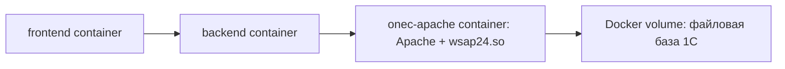

# DOC-INT-003. Интеграция 1С и Python через Docker

| Версия | Статус | Дата создания | Дата обновления |
|---|---|---|---|
| v1.0 | Draft | 2026-05-22 | 2026-05-22 |

О документе: подробная инструкция по альтернативному Docker-способу связать 1С и Python-бэкенд CRM_14.

Для кого: для backend-разработчика и участника команды, которому нужно быстро поднять Python/frontend в контейнерах и подключить их к 1С.

## 1. Главная идея Docker-сценария

Есть два разных Docker-подхода.

Первый и рекомендуемый для CRM_14: запускать в Docker только Python/backend, frontend и PostgreSQL, а 1С держать отдельно. Это проще, надежнее и не требует упаковывать платформу 1С в контейнер.

Второй: запускать 1С, Apache и Python в Docker-контейнерах. Это возможно, но сложнее из-за лицензирования 1С, закрытого дистрибутива, портов кластера 1С, хранения базы и обновления платформы.

## 2. Рекомендуемый вариант: Python в Docker, 1С снаружи

Схема:


Для Mac контейнер не может обращаться к `127.0.0.1` хоста как к самому Mac. Внутри контейнера `127.0.0.1` означает сам контейнер. Поэтому для доступа к сервису на хосте используется:

```text
host.docker.internal
```

Если 1С запущена на Mac через standalone-сервер:

```text
http://host.docker.internal:8314/Infobase/hs/http_methods
```

Если 1С опубликована через Apache на Mac:

```text
http://host.docker.internal/crm14/hs/http_methods
```

Если 1С опубликована на отдельном сервере:

```text
https://crm14.example.ru/crm14/hs/http_methods
```

## 3. Версии и зависимости

Актуально на 2026-05-22.

| Компонент | Версия/требование | Где задано |
|---|---|---|
| Docker Desktop for Mac | Поддерживаются текущая и две предыдущие major-версии macOS; минимум 4 GB RAM | Docker Docs |
| Docker Compose | Compose V2, команда `docker compose` | Поставляется с Docker Desktop |
| Python проекта | `>=3.12` | `backend/pyproject.toml` |
| Python latest official | `3.14.5` | python.org downloads |
| FastAPI | `>=0.115.0,<1.0.0` | `backend/pyproject.toml` |
| Uvicorn | `uvicorn[standard]>=0.30.0,<1.0.0` | `backend/pyproject.toml` |
| requests | `>=2.32.5` | `backend/pyproject.toml` |
| PostgreSQL image | `postgres:17-alpine` | корневой `docker-compose.yml` |
| Frontend | Vite/React | `frontend/package.json` |
| 1С | Локальный проект использует `/opt/1cv8/8.5.1.1150`; контейнерный вариант должен использовать ту же версию, что и база | Внешняя установка 1С |

## 4. Установка Docker Desktop на macOS

### 4.1. Установить Command Line Tools for Xcode

```bash
xcode-select --install
```

Проверка:

```bash
git --version
xcode-select -p
```

### 4.2. Установить Homebrew

```bash
/bin/bash -c "$(curl -fsSL https://raw.githubusercontent.com/Homebrew/install/HEAD/install.sh)"
```

Проверка:

```bash
brew --version
```

### 4.3. Установить Docker Desktop

Вариант через Homebrew Cask:

```bash
brew install --cask docker
```

Затем открыть Docker Desktop:

```bash
open -a Docker
```

Подождать, пока Docker запустится.

Проверка:

```bash
docker version
docker compose version
docker info
```

Если команда `docker info` возвращает данные сервера Docker, можно запускать compose.

## 5. Подключение текущего docker-compose.yml к 1С

В корне проекта уже есть `docker-compose.yml`:

```text
~/CRM_14/docker-compose.yml
```

В нем есть сервисы:

- `postgres`;
- `backend`;
- `frontend`.

Но по умолчанию backend получает `STORAGE_MODE=postgres`. Чтобы backend ходил в 1С, нужно переопределить переменные окружения.

### 5.1. Быстрый запуск через временный override-файл

В текущем корневом `docker-compose.yml` переменная `STORAGE_MODE` уже описана, но `ONEC_BASE_URL` не передается в контейнер backend. Поэтому для реального запуска нужно использовать override-файл.

Если 1С standalone запущена на Mac по адресу `http://127.0.0.1:8314/Infobase/hs/http_methods`, создать файл:

```bash
cd ~/CRM_14

cat > docker-compose.1c.override.yml <<'YAML'
services:
  backend:
    environment:
      STORAGE_MODE: "1c"
      ONEC_BASE_URL: "http://host.docker.internal:8314/Infobase/hs/http_methods"
      ONEC_TIMEOUT_SECONDS: "10"
      ONEC_MAX_RETRIES: "3"
      ONEC_RETRY_BACKOFF_SECONDS: "0.35"
YAML

docker compose -f docker-compose.yml -f docker-compose.1c.override.yml up --build
```

Если 1С опубликована через Apache на Mac, создать override с другим URL:

```bash
cd ~/CRM_14

cat > docker-compose.1c.override.yml <<'YAML'
services:
  backend:
    environment:
      STORAGE_MODE: "1c"
      ONEC_BASE_URL: "http://host.docker.internal/crm14/hs/http_methods"
      ONEC_TIMEOUT_SECONDS: "10"
      ONEC_MAX_RETRIES: "3"
      ONEC_RETRY_BACKOFF_SECONDS: "0.35"
YAML

docker compose -f docker-compose.yml -f docker-compose.1c.override.yml up --build
```

Если 1С опубликована на отдельном сервере:

```bash
cd ~/CRM_14

cat > docker-compose.1c.override.yml <<'YAML'
services:
  backend:
    environment:
      STORAGE_MODE: "1c"
      ONEC_BASE_URL: "https://crm14.example.ru/crm14/hs/http_methods"
      ONEC_TIMEOUT_SECONDS: "10"
      ONEC_MAX_RETRIES: "3"
      ONEC_RETRY_BACKOFF_SECONDS: "0.35"
YAML

docker compose -f docker-compose.yml -f docker-compose.1c.override.yml up --build
```

После запуска:

```text
frontend: http://127.0.0.1:5173
backend:  http://127.0.0.1:8000
swagger:  http://127.0.0.1:8000/docs
```

### 5.2. Постоянный локальный вариант через docker-compose.override.yml

Создать локальный файл `docker-compose.override.yml` в корне проекта:

```yaml
services:
  backend:
    environment:
      STORAGE_MODE: "1c"
      ONEC_BASE_URL: "http://host.docker.internal:8314/Infobase/hs/http_methods"
      ONEC_TIMEOUT_SECONDS: "10"
      ONEC_MAX_RETRIES: "3"
      ONEC_RETRY_BACKOFF_SECONDS: "0.35"
```

Запуск:

```bash
cd ~/CRM_14
docker compose up --build
```

Если 1С опубликована через Apache, заменить `ONEC_BASE_URL`:

```yaml
ONEC_BASE_URL: "http://host.docker.internal/crm14/hs/http_methods"
```

Если 1С на отдельном сервере:

```yaml
ONEC_BASE_URL: "https://crm14.example.ru/crm14/hs/http_methods"
```

## 6. Проверка Docker-сценария

### 6.1. Проверить, что 1С доступна с Mac

Для standalone:

```bash
curl -i --max-time 10 http://127.0.0.1:8314/Infobase/hs/http_methods/leads
```

Для Apache:

```bash
curl -i --max-time 10 http://127.0.0.1/crm14/hs/http_methods/leads
```

### 6.2. Проверить, что 1С доступна из контейнера backend

Запустить контейнеры:

```bash
cd ~/CRM_14
docker compose up -d --build
```

Проверить переменные внутри backend:

```bash
docker compose exec backend env | grep -E 'STORAGE_MODE|ONEC'
```

Проверить доступ к 1С из backend-контейнера:

```bash
docker compose exec backend python -c "import os, requests; url=os.environ['ONEC_BASE_URL'] + '/leads'; r=requests.get(url, timeout=10); print(r.status_code); print(r.text[:500])"
```

Если команда возвращает `200` и JSON, связь контейнера с 1С работает.

### 6.3. Проверить Python API

```bash
curl -i http://127.0.0.1:8000/api/v1/health
curl -i http://127.0.0.1:8000/api/v1/leads
```

Swagger:

```text
http://127.0.0.1:8000/docs
```

### 6.4. Проверить frontend

Открыть:

```text
http://127.0.0.1:5173
```

Если frontend показывает пустой список, проверить backend:

```bash
curl -i http://127.0.0.1:8000/api/v1/leads
```

Если backend возвращает ошибку 1С, смотреть `ONEC_BASE_URL` и доступность 1С из контейнера.

## 7. Полный контейнерный вариант: 1С + Apache + Python

Этот вариант сложнее и нужен только если требуется полностью контейнерный стенд.

Ниже описан учебный вариант с файловой базой 1С внутри Docker volume. Клиент-серверный вариант с кластером 1С тоже возможен, но для него нужен отдельный контейнер сервера 1С, настройка кластера, лицензирования, портов `ragent`/`rmngr`/`rphost` и создания информационной базы через `rac`.

Схема:



Риски:

- дистрибутив 1С нельзя просто скачать из публичного Dockerfile;
- нужны лицензии 1С и корректный способ их выдачи;
- обновление платформы 1С должно быть синхронизировано с базой;
- нужно хранить данные в Docker volumes;
- файловую базу внутри контейнера легко потерять при неправильном пересоздании;
- кластер 1С использует несколько портов, которые надо понимать и документировать.

## 8. Пример структуры файлов для полного Docker-стенда

```text
onec-docker/
  docker-compose.yml
  onec/
    Dockerfile
    entrypoint.sh
    dist/
      1c-enterprise83-common_*.deb
      1c-enterprise83-server_*.deb
      1c-enterprise83-ws_*.deb
      ...
  apache/
    crm14-1c.conf
```

Папку `dist/` не коммитить в git, потому что там закрытые дистрибутивы 1С.

## 9. Пример Dockerfile для контейнера 1С + Apache

Это шаблон. Его нужно адаптировать под реальные имена пакетов 1С.

```dockerfile
FROM ubuntu:24.04

ENV DEBIAN_FRONTEND=noninteractive
ENV ONEC_VERSION=8.3.27.XXXX

RUN apt-get update \
    && apt-get install -y --no-install-recommends \
       apache2 \
       ca-certificates \
       curl \
       locales \
       fontconfig \
       libfreetype6 \
       libglib2.0-0 \
       libgsf-1-114 \
       libgtk-3-0 \
       libnss3 \
       unixodbc \
       libx11-6 \
       libxext6 \
       libxi6 \
       libxrender1 \
       fonts-dejavu \
       fonts-liberation \
    && rm -rf /var/lib/apt/lists/*

RUN locale-gen ru_RU.UTF-8
ENV LANG=ru_RU.UTF-8
ENV LC_ALL=ru_RU.UTF-8

COPY dist/*.deb /tmp/onec/
RUN apt-get update \
    && apt-get install -y /tmp/onec/*.deb \
    && rm -rf /tmp/onec /var/lib/apt/lists/*

RUN mkdir -p /var/www/onec/crm14 \
    && chown -R www-data:www-data /var/www/onec

COPY entrypoint.sh /entrypoint.sh
RUN chmod +x /entrypoint.sh

EXPOSE 80

ENTRYPOINT ["/entrypoint.sh"]
```

В реальном проекте лучше разделить контейнеры:

- контейнер сервера 1С;
- контейнер Apache-публикации;
- контейнер PostgreSQL;
- контейнер Python backend.

Но для учебного стенда иногда проще собрать 1С и Apache вместе.

## 10. Пример entrypoint.sh для публикации через webinst

```bash
#!/usr/bin/env bash
set -euo pipefail

: "${ONEC_VERSION:?ONEC_VERSION is required}"
: "${ONEC_CONNSTR:?ONEC_CONNSTR is required}"
: "${ONEC_WSDIR:=crm14}"
: "${ONEC_PUBDIR:=/var/www/onec/crm14}"

mkdir -p "$ONEC_PUBDIR"
chown -R www-data:www-data "$ONEC_PUBDIR"

touch /etc/apache2/conf-available/crm14-1c.conf

/opt/1cv8/x86_64/$ONEC_VERSION/webinst -publish -apache24 \
  -wsdir "$ONEC_WSDIR" \
  -dir "$ONEC_PUBDIR" \
  -connstr "$ONEC_CONNSTR" \
  -confpath /etc/apache2/conf-available/crm14-1c.conf

a2enconf crm14-1c
apache2ctl configtest

exec apache2ctl -D FOREGROUND
```

Пример `ONEC_CONNSTR` для клиент-серверной базы:

```text
Srvr="onec-server";Ref="crm14";
```

Пример для файловой базы внутри volume:

```text
File="/var/lib/1c/bases/crm14";
```

## 11. Пример docker-compose.yml для полного учебного стенда

Это примерная схема. Ее нельзя считать готовой production-конфигурацией без адаптации к лицензиям и реальному дистрибутиву 1С.

```yaml
services:
  onec-apache:
    build:
      context: ./onec
    environment:
      ONEC_VERSION: "8.3.27.XXXX"
      ONEC_WSDIR: "crm14"
      ONEC_CONNSTR: 'File="/var/lib/1c/bases/crm14";'
    ports:
      - "127.0.0.1:8081:80"
    volumes:
      - onec_pub:/var/www/onec
      - onec_filebase:/var/lib/1c/bases/crm14

  backend:
    build:
      context: ../backend
    environment:
      STORAGE_MODE: "1c"
      ONEC_BASE_URL: "http://onec-apache/crm14/hs/http_methods"
      ONEC_TIMEOUT_SECONDS: "10"
      LOG_LEVEL: "INFO"
    ports:
      - "127.0.0.1:8000:8000"
    depends_on:
      - onec-apache

  frontend:
    build:
      context: ../frontend
    environment:
      VITE_API_BASE_URL: "http://localhost:8000/api/v1"
    ports:
      - "127.0.0.1:5173:5173"
    depends_on:
      - backend

volumes:
  onec_pub:
  onec_filebase:
```

В этой схеме backend обращается к 1С по внутреннему DNS Docker Compose:

```text
http://onec-apache/crm14/hs/http_methods
```

Перед первым запуском в volume `onec_filebase` должна быть создана или восстановлена файловая база 1С. Обычно это делают отдельной командой через инструменты платформы 1С или временный service/job-контейнер с `ibcmd`, если он доступен в установленном комплекте платформы.

## 12. Команды для полного Docker-стенда

Сборка:

```bash
cd ~/CRM_14/onec-docker
docker compose build
```

Запуск:

```bash
docker compose up -d
```

Логи:

```bash
docker compose logs -f onec-apache
docker compose logs -f backend
```

Проверка публикации 1С:

```bash
curl -i http://127.0.0.1:8081/crm14/hs/http_methods/leads
```

Проверка backend:

```bash
curl -i http://127.0.0.1:8000/api/v1/leads
```

Остановка:

```bash
docker compose down
```

Остановка с удалением volumes:

```bash
docker compose down -v
```

Команду `down -v` использовать только если точно можно удалить данные стенда.

## 13. Диагностика Docker-проблем

### 13.1. Backend не видит 1С на Mac

Неправильно:

```text
ONEC_BASE_URL=http://127.0.0.1:8314/Infobase/hs/http_methods
```

Внутри контейнера это означает сам контейнер backend.

Правильно:

```text
ONEC_BASE_URL=http://host.docker.internal:8314/Infobase/hs/http_methods
```

Проверка:

```bash
docker compose exec backend python -c "import requests; r=requests.get('http://host.docker.internal:8314/Infobase/hs/http_methods/leads', timeout=10); print(r.status_code); print(r.text[:300])"
```

### 13.2. Переменные окружения не попали в контейнер

Проверить:

```bash
docker compose exec backend env | sort | grep -E 'STORAGE_MODE|ONEC'
```

Если переменных нет, добавить их в `docker-compose.override.yml` или в секцию `backend.environment` основного compose-файла.

После изменения:

```bash
docker compose up -d --build
```

### 13.3. Контейнер backend стартует, но API возвращает ошибку 1С

Проверить логи:

```bash
docker compose logs --tail=200 backend
```

Проверить прямой запрос к 1С из контейнера:

```bash
docker compose exec backend python -c "import os, requests; url=os.environ['ONEC_BASE_URL'] + '/leads'; print(url); r=requests.get(url, timeout=10); print(r.status_code); print(r.text[:1000])"
```

Типовые причины:

- неправильный `ONEC_BASE_URL`;
- 1С не запущена;
- Apache не опубликован;
- 1С вернула не JSON-массив;
- HTTP-сервис в 1С упал с ошибкой.

### 13.4. Конфликт портов

Проверить занятые порты:

```bash
lsof -nP -iTCP:8000 -sTCP:LISTEN
lsof -nP -iTCP:5173 -sTCP:LISTEN
lsof -nP -iTCP:8314 -sTCP:LISTEN
```

Если порт занят, изменить проброс в compose:

```yaml
ports:
  - "127.0.0.1:8881:8000"
```

Тогда backend будет доступен на:

```text
http://127.0.0.1:8881
```

### 13.5. Docker Desktop не запущен

Проверить:

```bash
docker info
```

Если Docker не отвечает:

```bash
open -a Docker
```

Подождать запуска и повторить:

```bash
docker info
```

## 14. Что лучше использовать в CRM_14

Для текущего проекта рекомендуется порядок:

1. Основной способ: 1С опубликована через Apache, Python запускается локально или в Docker.
2. Для быстрой разработки: 1С standalone на Mac, Python запускается локально.
3. Для демонстрации Docker: Python/frontend/PostgreSQL в Docker, 1С снаружи через `host.docker.internal`.
4. Полностью контейнерная 1С: только если есть время, лицензии и понятная цель именно контейнеризовать 1С.

## 15. Контрольный чек-лист

- [ ] Docker Desktop установлен и запущен.
- [ ] `docker compose version` работает.
- [ ] 1С доступна с Mac через `curl`.
- [ ] В контейнере backend используется `host.docker.internal`, если 1С на Mac.
- [ ] `STORAGE_MODE=1c` передан в контейнер backend.
- [ ] `ONEC_BASE_URL` передан в контейнер backend.
- [ ] Из backend-контейнера работает запрос к `$ONEC_BASE_URL/leads`.
- [ ] `http://127.0.0.1:8000/api/v1/leads` возвращает данные.
- [ ] Frontend на `http://127.0.0.1:5173` видит backend.

## 16. Источники

- Docker Desktop for Mac installation documentation: https://docs.docker.com/desktop/setup/install/mac-install/
- Docker Docs via Context7: `/docker/docs`
- Python downloads: https://www.python.org/downloads/
- FastAPI documentation via Context7: `/fastapi/fastapi`
- Apache HTTP Server download page: https://httpd.apache.org/download.cgi?version=2.4.x
- 1C Knowledge Base: `webinst` utility: https://kb.1ci.com/1C_Enterprise_Platform/Guides/Administrator_Guides/1C_Enterprise_8.3.24_Administrator_Guide/Chapter_8._Setting_up_web_services_for_1C_Enterprise/8.3._Publication_types/8.3.3._Webinst_utility/
